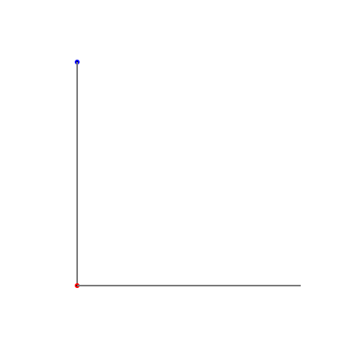

# La Courbe du dragon - programmation 1 : calculer le chemin

## Réponse à la question bonus

- L'épaisseur de la bandelette de feuille pliée 53 fois est d'environ 900 millions de km de haut, soit **la distance maximale entre la terre et jupiter**. Si on voulait parcourir cette distance à pied, c'est l'équivalent de faire **25 000 fois le tour de la terre (à l'équateur)**.

- La longueur de la bandelette de feuille pliée 53 fois est de 2,3 am (attomètre = 1 milliardième de milliardième de mètre) = environ **500 fois plus petit que la taille d'un noyau atomique** (un noyau atomique, c'est 100.000 fois plus petit qu'un atome...)

- Et si on plie la bandelette de feuille 53 fois, il y aura pour la fourmi 9.007.199.254.740.991 virages, soit **environ 10 millions de milliards** de virages !

## Comment programmer la courbe du dragon ?

Nous pouvons utiliser de la programmation pour dessiner des segments de droites consécutifs avec des angles de 90°.

 

De nombreuses solutions techniques à ce problème existent. Nous utiliserons une solution qui s'intégre à cette page web et qui utilise le langage C.

Mais par contre, nous avons besoin de dire à l'ordinateur quels segments dessiner, et dans quel ordre !

En fait, cela correspond à donner le chemin que va suivre la fourmi pour partir de la gommette bleue de départ et arriver jusqu'à l'autre bout de la bande de papier.

La fourmi fait des quarts de tours (90°) soit à gauche, soit à droite.

Pour dessiner la courbe du dragon, il nous faut découvrir un moyen de trouver le chemin pour un nombre de plis donnés.

C'est notre défi !

## Le défi : construire le chemin de la fourmi à partir du chemin précédent

Une manière trés classique de calculer des choses en programmation consiste à le faire par étapes.

On connaît le résultat (le chemin) pour une première étape et on crée un algorithme, une recette, un mode d'emploi, qui permet de trouver le résultat (le chemin) de l'étape suivante à partir de celui qu'on connait.

Nous devons donc réussir à trouver un algorithme qui permet de trouver le chemin de la fourmi lorsqu'on a plié n fois la bandelette de papier, à partir du chemin de la fourmi lorsqu'on a plié n-1 fois la bandelette de papier.

Grâce aux notes que nous avons prises, nous avons obtenu ceci :

```
niveau 1 : G
niveau 2 : GGD
niveau 3 : GGDGGDD
niveau 4 : GGDGGDDGGGDDGDD
```

Qui pourrait dire ce que sera la chemin de la fourmi au niveau 5 ?

 

<br><br>

Pour nous aider, on va réarranger un peu les choses : 

```
niveau 1 :         G
niveau 2 : G       G D
niveau 3 : GGD     G GDD
niveau 4 : GGDGGDD G GGDDGDD
```
Quelqu'un voit-il comment on peut passer du niveau 3 au niveau 4 ?

Réponse à la page suivante...
