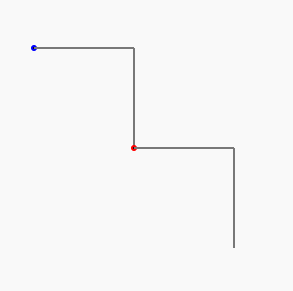

# La Courbe du dragon - programmation 2 - dessiner une deuxième marche d'escalier

## Réponse à la question pécédente

```
niveau 1 :         G
niveau 2 : G       G D
niveau 3 : GGD     G GDD
niveau 4 : GGDGGDD G GGDDGDD
```

<br>
Pour passer du niveau 3 au niveau 4, on remarque que la première partie du chemin est égale au chemin du niveau précédent :
<br><br>

niveau 3 : `GGD G GDD`
<br>
niveau 4 : `GGDGGDD` G GGDDGDD
<br><br>
Ensuite, on a (toujours un "G" qui correspond au tout premier pli effectué)
<br><br>
Ensuite, on doit lire à l'envers (de droite à gauche) le chemin précédent et inverser les G et les D et on obtient la deuxième moitié du chemin !

<br><br>

## Dessiner avec du code : un segment de droite

Amusons-nous maintenant à dessiner avec du code !

Ce que nous allons faire maintenant est très simple : faire tracer un segment de droite grâce à notre petit programme ci-dessous !

Voici le programme qui permet de le faire :

@[drawing_dragon_1]({"stubs": ["main.c"],"command": "sh /project/target/run.sh", "project" : "drawing_dragon_1"})

**! Vous pouvez appuyer sur "Run" pour exécuter ce code et visualiser le dessin obtenu.**

*NB : si vous obtenez l'erreur "Unable to open static viewer" ou si rien ne s'affiche, ce n'est pas grave, il faut juste insister sur le bouton "run" (ou "success") et ça devrait finir par fonctionner.*

Comme on le voit la commande

```C
draw(100);
```

permet de tracer un segment de droite de 100 pixels en partant du centre de la feuille et en traçant ver la droite.

Qui peut dire ce qu'est un pixel ?

<br><br>

## Dessiner avec du code : deux segments de droites

Voici maintenant un programme qui fait tracer un segment de droite vers la droite **, puis fait un virage vers la droite de 90° (1/4 de tour) et ensuite trace à nouveau un segment de droite de 100 pixels (vers le bas, donc !)** : 

@[drawing_dragon_2]({"stubs": ["main.c"],"command": "sh /project/target/run.sh", "project" : "drawing_dragon_2"})

**! Vous pouvez appuyer sur "Run" pour exécuter ce code et visualiser le dessin obtenu.**

*NB : si vous obtenez l'erreur "Unable to open static viewer" ou si rien ne s'affiche, ce n'est pas grave, il faut juste insister sur le bouton "run" (ou "success") et ça devrait finir par fonctionner.*

Comme on le voit la commande

```C
turn(90,RIGHT);
```

permet de faire un virage de 90 degrés vers la droite. (En imaginant les segments comme un chemin parcouru par une fourmi, la fourmi tourne de 90° à sa droite.)

On peut également faire faire un virage vers la gauche à notre fourmi en écrivant : 

```C
turn(90,LEFT);
```

Notons que le dessin effectué à cet étape ressemble à une marche d'escalier.

<br><br>

## Défi : compléter le dessin pour faire une deuxième marche d'escalier !

Nous allons maintenant compléter ce programme pour qu'il dessinne une seconde marche d'escalier : 

 

À vous de jouer !

@[drawing_dragon_3]({"stubs": ["main.c"],"command": "sh /project/target/run.sh", "project" : "drawing_dragon_3"})

**! Vous pouvez appuyer sur "Run" pour exécuter ce code et visualiser le dessin obtenu.**

*NB : si vous obtenez l'erreur "Unable to open static viewer" ou si rien ne s'affiche, ce n'est pas grave, il faut juste insister sur le bouton "run" (ou "success") et ça devrait finir par fonctionner.*
