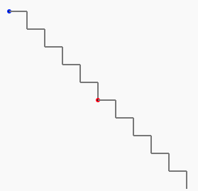

# La Courbe du dragon - programmation 3 - 10 marches d'escaliers

## 2 marches d'escalier

Le programme qui permet de tracer 2 marches d'escalier est donc

@[drawing_dragon_4]({"stubs": ["main.c"],"command": "sh /project/target/run.sh", "project" : "drawing_dragon_4"})

**! Vous pouvez appuyer sur "Run" pour exécuter ce code et visualiser le dessin obtenu.**

*NB : si vous obtenez l'erreur "Unable to open static viewer" ou si rien ne s'affiche, ce n'est pas grave, il faut juste insister sur le bouton "run" (ou "success") et ça devrait finir par fonctionner.*

Notons que si on voulait prolonger notre dessin vers la droite, nous devrions alors faire tourner la fourmi de 90° vers sa gauche.

On aurait alors les instructions :

```C
draw(100);

turn(90,RIGHT);
	
draw(100);
	
turn(90,LEFT);
	

    
draw(100);

turn(90,RIGHT);

draw(100);

turn(90,LEFT);
```

N'y a-t-il pas des instructions qui se répètent ?

<br><br>

Avec nos programmes sur ce site, nous pouvons utiliser des boucles plutôt que de réécrire plusieurs fois les mêmes insctructions !

Nous pouvons écrire par exemple :

```C
repeat(2) {
    draw(15);
    turn(30,LEFT);
} loop;
```

plutôt que d'écrire 

```C
draw(15);
turn(30,LEFT);
draw(15);
turn(30,LEFT);
```

<br><br>

Ou bien nous pouvons écrire par exemple :

```C
repeat(5) {
    draw(15);
    turn(30,LEFT);
} loop;
```

plutôt que d'écrire 

```C
draw(15);
turn(30,LEFT);
draw(15);
turn(30,LEFT);
draw(15);
turn(30,LEFT);
draw(15);
turn(30,LEFT);
draw(15);
turn(30,LEFT);
```
C'est plus court à écrire et ça donne le même résultat !

Nous avons maintenant tout en main pour pouvoir dessiner nos 2 marches d'escalier avec un programme plus court, grâce à une boucle

```C
repeat(2) {
    ...
} loop;
```

## 2 marches d'escalier en boucle

@[drawing_dragon_5]({"stubs": ["main.c"],"command": "sh /project/target/run.sh", "project" : "drawing_dragon_5"})

**! Vous pouvez appuyer sur "Run" pour exécuter ce code et visualiser le dessin obtenu.**

*NB : si vous obtenez l'erreur "Unable to open static viewer" ou si rien ne s'affiche, ce n'est pas grave, il faut juste insister sur le bouton "run" (ou "success") et ça devrait finir par fonctionner.*

Quand c'est réussi, pourquoi pas 10 marches ? Allons-y !

## 10 marches d'escalier en boucle

 

@[drawing_dragon_6]({"stubs": ["main.c"],"command": "sh /project/target/run.sh", "project" : "drawing_dragon_6"})

**! Vous pouvez appuyer sur "Run" pour exécuter ce code et visualiser le dessin obtenu.**

*NB : si vous obtenez l'erreur "Unable to open static viewer" ou si rien ne s'affiche, ce n'est pas grave, il faut juste insister sur le bouton "run" (ou "success") et ça devrait finir par fonctionner.*

 

Si votre escalier sort de la feuille, il suffit de dessiner des segments de droites plus courts :

Avec :

```C
draw(50);
```

Nos segments de droites seront de 50 pixels (deux fois plus courts.)