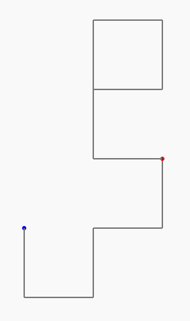

# La Courbe du dragon - programmation 4 - 10 premiers virages de la courbe du dragon niveau 4

## Rappel

Au niveau 4 (avec 4 plis), dans la courbe du dragon, nous avions 15 virages :

```
niveau 1 :         G
niveau 2 : G       G D
niveau 3 : GGD     G GDD
niveau 4 : GGDGGDD G GGDDGDD
```

Et nous avons fait 10 marches d'escaliers en écrivant : 

```C
    repeat (10) {
		draw(50);
		turn(90,RIGHT);
		draw(50);
		turn(90,LEFT);
    } loop;
```

<br><br>

## Niveau supérieur : la croube du dragon, programme presque complet...

Nous allons maintenant passer au niveau supérieur, notre programme va intégrer du code en plus qui permet de dessiner la courbe du dragon :

@[drawing_dragon_7]({"stubs": ["main.c"],"command": "sh /project/target/run.sh", "project" : "drawing_dragon_7"})

**! Vous pouvez appuyer sur "Run" pour exécuter ce code et visualiser le dessin obtenu.**

*NB : si vous obtenez l'erreur "Unable to open static viewer" ou si rien ne s'affiche, ce n'est pas grave, il faut juste insister sur le bouton "run" (ou "success") et ça devrait finir par fonctionner.*

Dans ce programme, nous avons toujours 10 marches d'escaliers, mais nous avons également :

init_dragon();

qui permet de construire une liste de nombres 0 ou 1 qui indiquent s'ils faut tourner à gauche ou à droite.

On peut le voir comme une suite de 'D' ou de 'G' pour indiquer à la fourmi s'il faut tourner de 90° vers sa gauche ou vers sa droite.

<br><br>

## Les conditions

En programmation, on appelle une **condition** un code qui peut-être soit vrai, soit faux, et rien d'autre.

Grâce aux lignes de codes que nous avons ajoutées, nous avons également un moyen de savoir s'il faut tourner à gauche ou à droite selon le numéro du virage en utilisant la condition suivante&nbsp;:

```C
G_OU_D(chemin, i) == DROITE
```

Ceci sera VRAI quand il faut tourner à droite et FAUX quand il faut tourner à gauche.

Par exemple :

```C
G_OU_D(chemin, 4) == DROITE
```

sera VRAI s'il faut tourner à droite au 4e virage et FAUX s'il fallait tourner à gauche.

Ou encore :

```C
G_OU_D(chemin, 156) == DROITE
```

sera VRAI s'il faut tourner à droite au 156e virage et FAUX s'il fallait tourner à gauche.

<br><br>

## Les alternatives

Ce que nous allons faire maintenant, c'est d'utiliser un mécanisme de programmation de prise de décision afin de faire *comme si* notre fourmi était intelligente et qu'on lui avait appris une règle à suivre.

En programmation, ce mécanisme pour préprogrammer une prise de décision s'appelle une alternative.

En langage C, une alternative s'écrira comme ceci :

```C
        if (condition) {
            instructions_si_condition_vraie
        } else {
            instructions_si_condition_fausse
        }
```

- Dans `condition`, nous pourrons utiliser des instructions spécifiques qui sont parfois vraies, parfois fausses ;

- Dans le cas où la condition est vraie, seules les instructions (que nous avons dénommées ici plus haut `instructions_si_condition_vraie`) qui sont placées entre la première paire d'accolades ({...}) seront exécutées ;

- Mais dans le cas contraire (si la condition est fausse), seules les instructions (que nous avons dénommées ici plus haut `instructions_si_condition_fausse`) qui sont placées entre la seconde paire d'accolades ({...}) seront exécutées !

La `condition` que nous allons pouvoir utiliser sera donc évidemment :

```C
G_OU_D(chemin, i) == DROITE
```

qui indique si oui (vrai) ou non (faux) la fourmi doit tourner à droite. Et si c'est non, elle doit donc tourner à gauche.

Et les `instructions_si_condition_vraie` seront donc simplement :

```C
turn(90,RIGHT);
```

Et les `instructions_si_condition_fausse` seront donc simplement :

```C
turn(90,LEFT);
```

<br><br>

## La fin de la boucle

Ensuite nous pourrons tracer un segment de droite d'une lonqueur adaptée avec l'instruction :

```C
draw(longueur_segment);
```
En effet, `longueur_segment` est calculé par notre programme pour être toujours convenable en fonction de la taille de la courbe du dragon (en fonction du niveau).

Pour que ça fonctionne, il faudra enfin ajouter :

```C
i = i + 1;
```

à la fin de la boucle.

`i` permet de mémoriser à quelle virage nous sommes et `i = i + 1;` permet de compter dans i et donc de préciser que nous sommes 1 virage plus loin.

<br><br>

## Le dernier défi : terminer le programme qui dessine les 10 premiers virages de la courbe du dragon (niveau 4) !

 

Toutes les infos sont plus haut, il faut utiliser tout ça correctement pour terminer un programme capable de dessiner une courbe du dragon.

NB: en lignes 27 et 28, nous avons ajoutés les instructions :

```C
turn(90,RIGHT);
draw(longueur_segment);
```

qui permettent de commencer le premier segment (jusqu'avant le premier virage) en allant vers le bas.

@[drawing_dragon_8]({"stubs": ["main.c"],"command": "sh /project/target/run.sh", "project" : "drawing_dragon_8"})

**! Vous pouvez appuyer sur "Run" pour exécuter ce code et visualiser le dessin obtenu.**

*NB : si vous obtenez l'erreur "Unable to open static viewer" ou si rien ne s'affiche, ce n'est pas grave, il faut juste insister sur le bouton "run" (ou "success") et ça devrait finir par fonctionner.*
