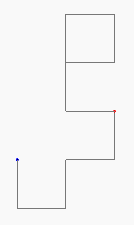
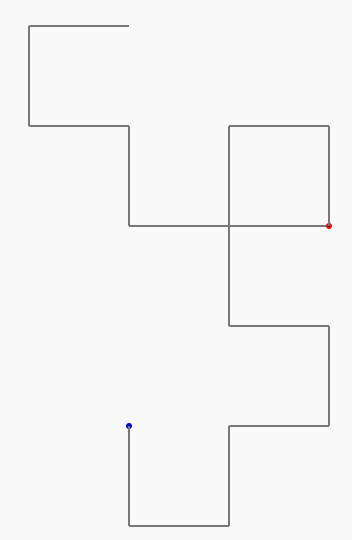

# La Courbe du dragon - programmation 5 - Le programme presque complet

## Rappel

Nous avons obtenu un bébé dragon (niveau 4) incomplet, comme ceci :

 

Alors que la véritable courbe du dragon avec 4 plis est comme ceci :

 

Avec 15 virages (et 16 segments) et non pas 10 !

Nous pourrions obtenir le dragon (niveau 4) complet en écrivant :

```C
repeat (15) {
```

au lieu de 

```C
repeat (10) {
```

Et ça marcherait ! :-)

...Mais ça ne marcherait que pour les courbes de niveau 4 ! :-(

<br><br>

Heureusement, nous avons dans notre programme les lignes de code suivantes :

```C
int nbVirages() {
    /*
    etape  chemin                       - nombre de virages
           debut    milieu fin            debut milieu fin
    1               G                   - 0     1      0   =   1 + 2 x 0  =  1  virage
    2      G        G      D            - 1     1      1   =   1 + 2 x 1  =  3  virages
    3      GGD      G      GDD          - 3     1      3   =   1 + 2 x 3  =  7  virages
    4      GGDGGDD  G      GGDDGDD      - 7     1      7   =   1 + 2 x 7  =  15 virages
    ...
    x-1                                                                   =  p  virages
    x                                                      =   1 + 2 x p        virages
    ...
    */

    int p=0;

    repeat (etape) {
        p = 1 + 2 * p;
    } loop;

    return p;
}
```

qui nous permettent d'obtenir le nombre exact de virages nécéssaires en fonction du niveau de la courbe, simplement en écrivant le code suivant :

```C
nbVirages()
```

Nous allons donc pouvoir écrire :

```C
repeat (nbVirages()) {
```

au lieu de : 

```C
repeat (10) {
```

afin d'obtenir un dragon complet quel que soit son niveau !

<br><br>

## Le programme à terminer avec la toute dernière ligne !

@[drawing_dragon_9]({"stubs": ["main.c"],"command": "sh /project/target/run.sh", "project" : "drawing_dragon_9"})

**! Vous pouvez appuyer sur "Run" pour exécuter ce code et visualiser le dessin obtenu.**

*NB : si vous obtenez l'erreur "Unable to open static viewer" ou si rien ne s'affiche, ce n'est pas grave, il faut juste insister sur le bouton "run" (ou "success") et ça devrait finir par fonctionner.*
