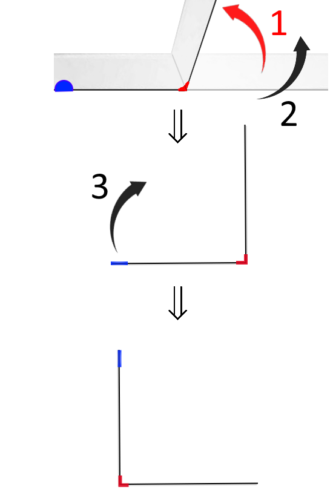

# La Courbe du dragon - niveau 1 (1 pli)

## Manip 1

 

1) Plier la feuille à angle droit et
2) tenir la feuille devant soi, vue de la tranche, 
3) ensuite pivoter votre bandelette de manière à voir un "L" (vu d'en haut) :

 

  

## Question 1

 

Imaginez une fourmi qui part de la gommette bleue en haut du "L" et qui parcourt le long de la tranche pour arriver à l'autre bout de la feuille !

Elle part tout droit, puis tourne d'1/4 de tour vers SA gauche ou vers SA droite ?

  

## Réponse 1, noter le chemin de la fourmi :

 

Notez maintenant sur la feuille fournie ("Atelier Dragon : Feuille de réponses") : "niveau 1 :" puis tracez le "L" obtenu, puis indiquez le chemin de la fourmi **en notant "G" pour "Gauche" et "D" pour "Droite"**

  

## Question 2

 

Combien de virages a fait la fourmi ?

  

## Réponse 2, noter le nombre de virages :

 

Noter maintenant le nombre de virages, sur la 2e feuille au niveau 1, sous "nombre de virages : " !

  

## Question 3

 

En supposant que la bandelette de feuille fait 0,1mm d'épaisseur et 20cm en longueur, quel est l'épaisseur et quelle est la longueur de la bandelette pliée en 2 ?

  

## Réponse 3, noter les dimensions de la bandelette de papier :

 

Noter maintenant les dimensions de la bandelette ainsi pliée (calculs et réponses), sur la 2e feuille au niveau 1, sous "épaisseur feuille pliée : " et sous "et longueur : " !
