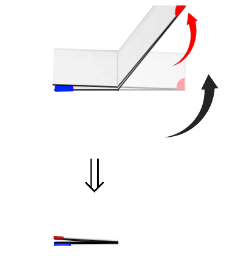

# La Courbe du dragon - niveau 2 (2 plis)

## Manip 1 : replier 2 fois

 

Replier la bandelette de papier, puis plier à nouveau TOUJOURS DE LA MEME MANIERE (**en rabattant la droite vers la gauche par en haut**) en 2 parties égales. **NE PAS DEPLIER !**

 

  

## Devinette

 

Si on déplie (comme avant) en formant uniquement des angles droits : combien y en aura-t-il ? (Combien la fourmi va-t-elle faire de virage ?)

Et si on place la feuille comme au niveau 1 (avec la gommette bleue en haut), essayez de deviner le dessin que l'on va obtenir !

  

## Manip 2 : déplier et faire des angles droits

 

Poser la bandelette sur la tranche pour voir le dessin vu d'en haut (on doit voir la gommette bleue en haut).

 

Est-ce le dessin que vous avez deviné ? ;-)

  

## Question 1

 

Imaginez de nouveau une fourmi qui part de la gommette bleue et qui parcourt le long de la tranche pour arriver à l'autre bout de la feuille !

Elle part tout droit, puis quel sera son chemin ? Elle tourne (chaque fois d'1/4 de tour) vers ... ?

  

## Réponse 1, noter le chemin de la fourmi :

 

Sur la feuille de réponses, au niveau 2, tracer le dessin obtenu puis indiquer le chemin de la fourmi  **en notant "G" pour "Gauche" et "D" pour "Droite"**

  

## Question 2

 

Combien de virages a fait la fourmi ?

  

## Réponse 2, noter le nombre de virages :

 

Noter maintenant le nombre de virages, sur la feuille de réponses, au niveau 2, sous "nombre de virages : "

  

## Question 3

 

Puisqu'au niveau précédent, la bandelette faisait 0,2mm d'épaisseur et 10cm de long, quelle est l'épaisseur et quelle est la longueur de la bandelette pliée à ce niveau-ci ?

  

## Réponse 3, noter les dimensions de la bandelette de papier :

 

Noter maintenant les dimensions de la bandelette ainsi pliée (calculs et réponses), sur la feuille de réponses au niveau 2, sous "épaisseur : " et sous "longueur : "